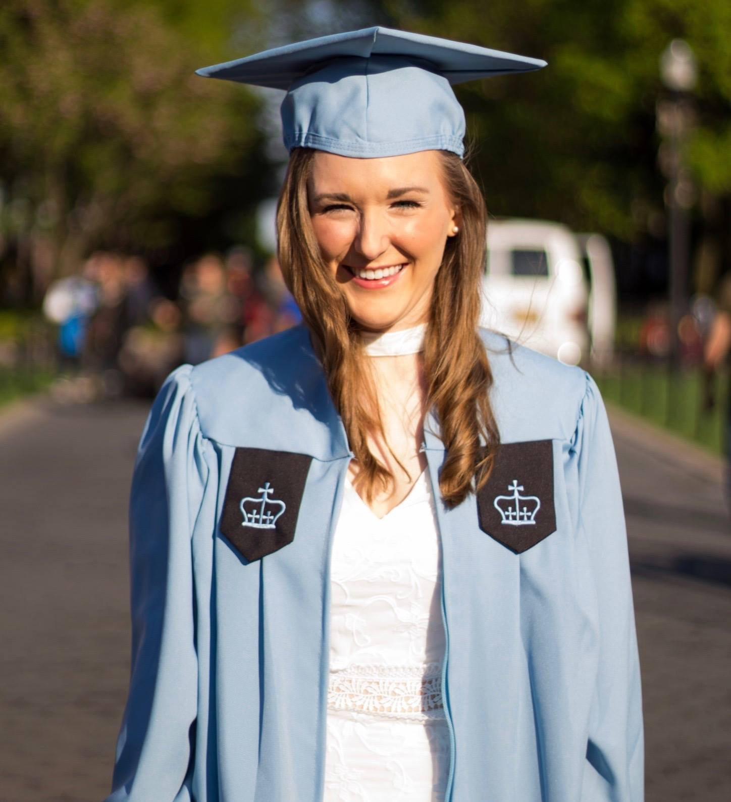

---
---

<link rel="stylesheet" href="styles.css" type="text/css">

My passion for biostatistics is rooted in my desire to help improve the quality of life and health of individuals worldwide. I am a 2018 graduate of the MS in Biostatistics program at [Columbia University Mailman School of Public Health](https://www.mailman.columbia.edu/), and hold a BS in Health Science and Spanish minor from [Springfield College](https://springfield.edu) (2016).

Currently, I am a Research Biostatistician I in the [Department of Healthcare Policy and Research](http://hpr.weill.cornell.edu/divisions/biostatistics/) (Division of Biostatistics and Epidemiology) at Weill Cornell Medicine. My work entails the conduction of short-term and long-term biostatistical consultations with clinicians and investigators at Weill Cornell Medicine and surrounding hospitals in the NYC area. I assist investigators with study planning, data analysis and graphics production, and strive to translate these results into meaningful conclusions. I currently collaborate with investigators in the fields of pediatrics, urology, cardiothoracic surgery, and colorectal cancer. 

I am also an avid traveler, and enjoy meeting people from different countries and learning about different cultures.
