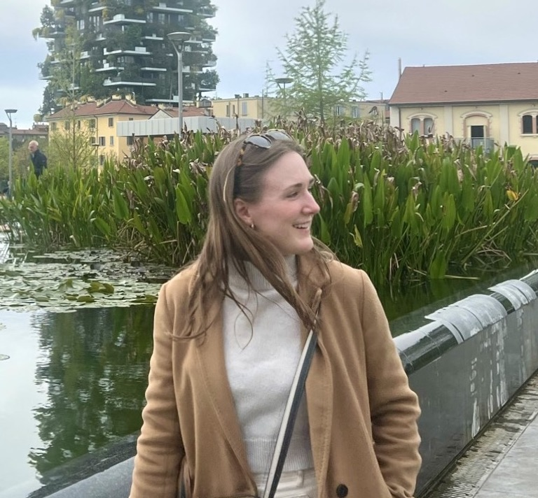

 
 
 

 

# Victoria Cooley

I am an applied biostatistician and researcher who is passionate about the early detection and prevention of cancer. Currently I am a Doctoral Researcher at the German Cancer Research Center/Deutsches Krebsforschungszentrum (DKFZ) in the Division of Cancer Epidemiology within the Hormones and Cancer research group. My work involves the discovery and validation of biomarkers for the earlier detection of ovarian cancer. I also enjoy the visual representation of data and learning about new graphical production techniques. I am also an avid traveler, and enjoy meeting people from different countries and learning about different cultures.

 

 

## Education

**Columbia University \|** New York, NY

Master of Science in Biostatistics \| 09/2016 -- 05/2018

**Springfield College \|** Springfield, MA

Bachelor of Science in Health Science \| 09/2012 -- 05/2016

